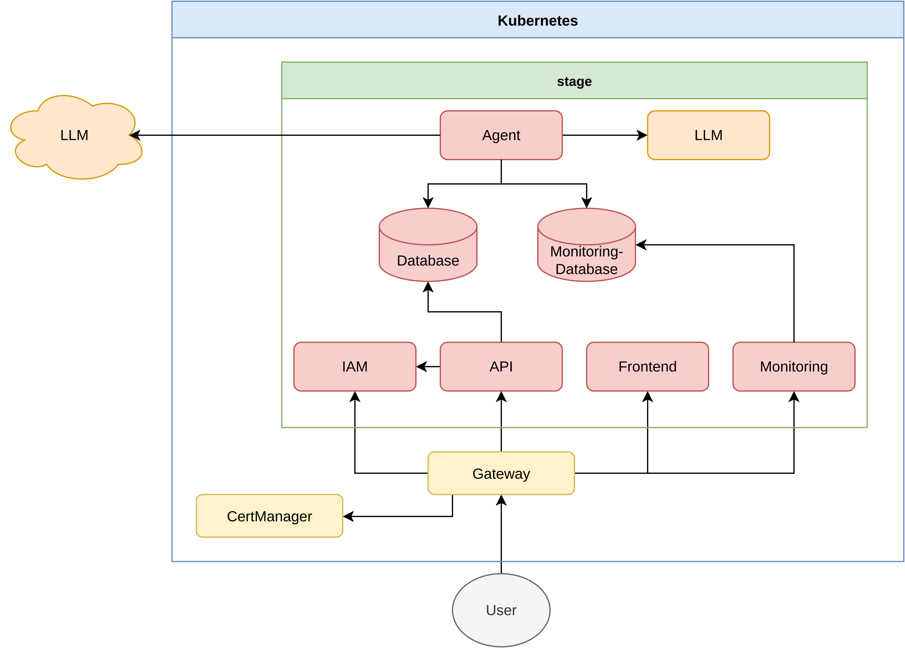

# Kubernetes Networking

Kubernetes Gateway API infrastructure for ingress, TLS termination, and certificate management.

## Architecture



## Components

- **Gateway Controller** — Envoy Gateway controller for ingress and TLS routing
- **Certs** — cert-manager for TLS certificate management

## Deployment

### Local

Requires [Rancher Desktop](https://rancherdesktop.io/).

Env variables can be found in `environments/local.yaml`.

Build and deploy local images:

```sh
kubectl config use-context rancher-desktop
helmfile -f helmfile.yaml -e local sync
```

Access at:

```
http://localhost:32080
https://localhost:32443
```

### Dev

Env variables can be found in `environments/dev.yaml`.

Deployment is orchestrated by the CI/CD workflow in `.github`.

Access at:

```
http://dev.{domain}
https://dev.{domain}
```

### Prod

Env variables can be found in `environments/prod.yaml`.

Deployment is orchestrated by the CI/CD workflow in `.github`.

Access at:

```
http://prod.{domain}
https://prod.{domain}
```

## Links

- [Cloudfleet](https://cloudfleet.ai/) — managed Kubernetes provider
- [Hetzner](https://www.hetzner.com/) — cloud infrastructure provider
